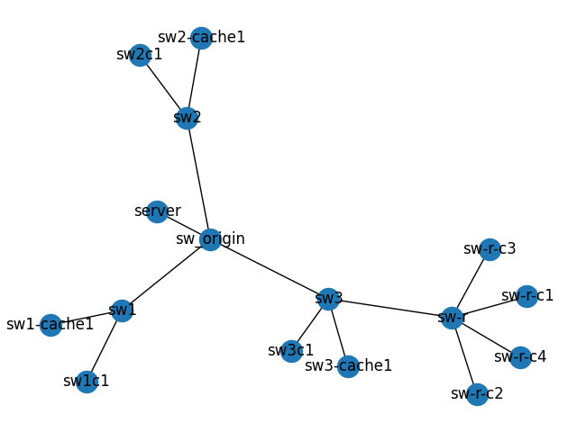

The topology is shown below.



In this experiment, `sw-r-c{1,2,3,4}` start streaming at the same time. 
The nearest cache server for these clients is `sw3-cache1`. 

These four clients all stream from `sw3-cache1`.

This experiment is trying to show the streaming performance if there are several clients compete without fairness.

The bandwidth between `sw-r->sw3->sw3-cache1` is not limited in this experiment. 

The actual bandwidth along this link is measured using iperf3 between `sw3-cache1` and `sw-r-c1`
```
IP for `sw3-cache1`: 10.10.10.18
IP for `sw-r-c1`: 10.10.10.22
```
```bash
clarkzjw@sw-r-c1:~$ iperf3 -c 10.10.10.18
Connecting to host 10.10.10.18, port 5201
[  4] local 10.10.10.22 port 33524 connected to 10.10.10.18 port 5201
[ ID] Interval           Transfer     Bandwidth       Retr  Cwnd
[  4]   0.00-1.00   sec  14.0 MBytes   117 Mbits/sec  137    160 KBytes
[  4]   1.00-2.00   sec  11.4 MBytes  95.4 Mbits/sec    0    209 KBytes
[  4]   2.00-3.00   sec  11.4 MBytes  95.4 Mbits/sec    0    247 KBytes
[  4]   3.00-4.00   sec  11.4 MBytes  95.9 Mbits/sec    0    280 KBytes
[  4]   4.00-5.00   sec  11.3 MBytes  94.9 Mbits/sec    0    311 KBytes
[  4]   5.00-6.00   sec  11.4 MBytes  95.9 Mbits/sec    0    338 KBytes
[  4]   6.00-7.00   sec  11.4 MBytes  95.9 Mbits/sec    0    363 KBytes
[  4]   7.00-8.00   sec  11.4 MBytes  95.4 Mbits/sec    0    386 KBytes
[  4]   8.00-9.00   sec  11.4 MBytes  95.9 Mbits/sec    0    409 KBytes
[  4]   9.00-10.00  sec  11.4 MBytes  95.4 Mbits/sec    0    430 KBytes
- - - - - - - - - - - - - - - - - - - - - - - - -
[ ID] Interval           Transfer     Bandwidth       Retr
[  4]   0.00-10.00  sec   117 MBytes  97.7 Mbits/sec  137             sender
[  4]   0.00-10.00  sec   114 MBytes  95.9 Mbits/sec                  receiver

iperf Done.
```

They are playing the same video, so the cache hit rate might not be very useful.
