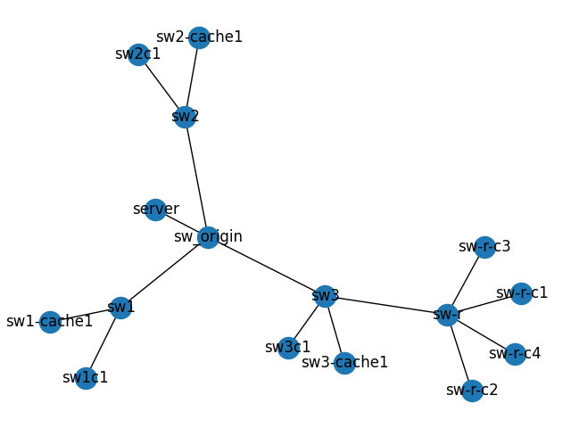

The topology is shown below.



The setting is similar to [1.baseline](../1.baseline/README.md), but we limit the bandwidth between `sw-r->sw3->sw3-cache1`.

As shown in [1.baseline](../1.baseline/README.md), the physical bandwidth is around `95.4 Mbits/sec`. 

The highest bitrate for BigBuckBunny used is `3.9Mbps`. We are going to limit the total bandwidth between `sw-r->sw3->sw3-cache1` to 1Mbps.

In theory, there should be competition and more quality switch now.

The speed limit is set using the following command:

Login to sw3, find the corresponding ovs port for sw3-cache1, which is `eth3`. The mapping can be obtained here: https://github.com/CSc579s22/Main/blob/master/server/config.py#L43
```bash
sudo ovs-vsctl set port eth3 qos=@qoseth3 -- --id=@qoseth3 create qos type=linux-htb other-config:max-rate=1000000
```
More info here: https://csc579s22.wordpress.com/2022/03/21/openflow-qos/

Verify:
```bash
clarkzjw@sw3c1:~$ iperf3 -c 10.10.10.18
Connecting to host 10.10.10.18, port 5201
[  4] local 10.10.10.20 port 59594 connected to 10.10.10.18 port 5201
[ ID] Interval           Transfer     Bandwidth       Retr  Cwnd
[  4]   0.00-1.00   sec   580 KBytes  4.75 Mbits/sec    0   80.6 KBytes
[  4]   1.00-2.00   sec   192 KBytes  1.57 Mbits/sec    0   86.3 KBytes
[  4]   2.00-3.00   sec   127 KBytes  1.04 Mbits/sec    0   93.3 KBytes
[  4]   3.00-4.00   sec   127 KBytes  1.04 Mbits/sec    0   99.0 KBytes
[  4]   4.00-5.00   sec   191 KBytes  1.56 Mbits/sec    0    112 KBytes
[  4]   5.00-6.00   sec   255 KBytes  2.09 Mbits/sec    0    137 KBytes
[  4]   6.00-7.00   sec   318 KBytes  2.61 Mbits/sec    0    175 KBytes
[  4]   7.00-8.00   sec   445 KBytes  3.65 Mbits/sec    0    230 KBytes
[  4]   8.00-9.00   sec   445 KBytes  3.65 Mbits/sec    0    290 KBytes
[  4]   9.00-10.00  sec   445 KBytes  3.65 Mbits/sec    0    346 KBytes
- - - - - - - - - - - - - - - - - - - - - - - - -
[ ID] Interval           Transfer     Bandwidth       Retr
[  4]   0.00-10.00  sec  3.05 MBytes  2.56 Mbits/sec    0             sender
[  4]   0.00-10.00  sec  1.48 MBytes  1.24 Mbits/sec                  receiver

iperf Done.
```

As the iperf3 results shown, the max bandwidth between `sw-r-c1` to `sw3-cache1` is limited to around 1Mbps.

Now run the experiment again.
