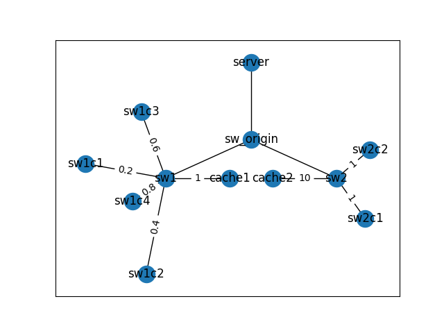

The topology is shown below.

In this experiment, `sw1-c{1,2,3,4}` start streaming at the same time. 
The nearest cache server for these clients is `cache1`.

The weight of each edge represents the maximum bandwidth of a given link. (Unit: Mbps)

Unlike previous experiments, some clients within sw1 group are redirected to stream from `cache2` instead.

Because there are plenty available bandwidth between `cache2` to `sw2`.
